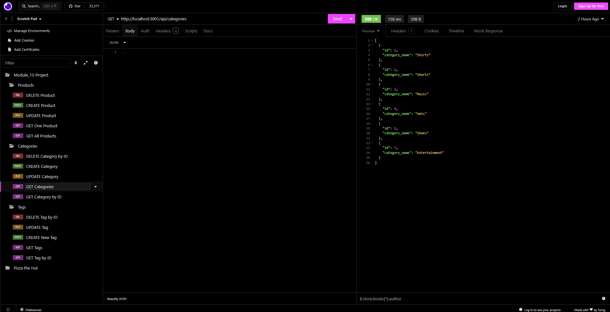
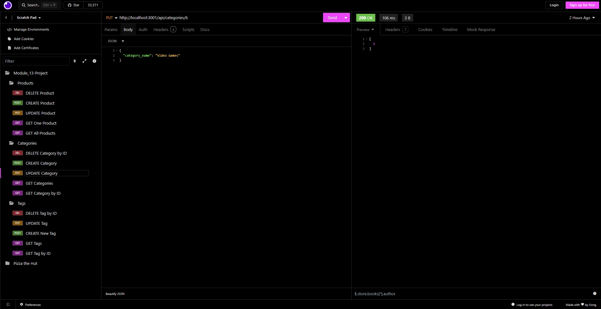
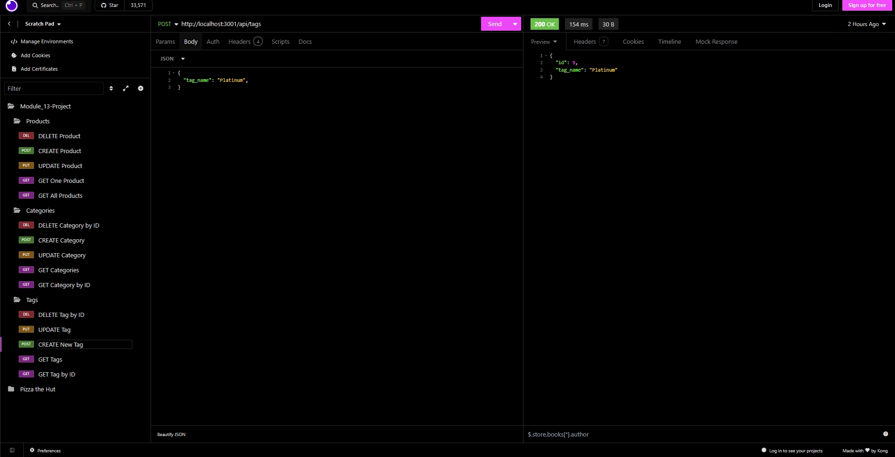
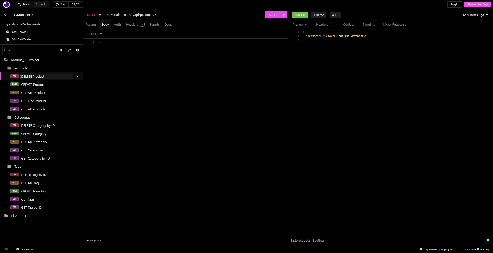

# E-Commerce Back End

## Table of Contents

- [E-Commerce Back End](#e-commerce-back-end)
  - [Table of Contents](#table-of-contents)
  - [Description](#description)
  - [Technologies and Packages Used](#technologies-and-packages-used)
  - [Installation](#installation)
  - [Usage](#usage)
    - [Video Demonstrating Application In Use](#video-demonstrating-application-in-use)
    - [Screenshots of the Application](#screenshots-of-the-application)
  - [Credits](#credits)
  - [License](#license)

## Description

This project is an application an E-commerce back end as a REST API. It uses packages such as "PostgreSQL Node client" and "Dotenv" through [Express.js](https://expressjs.com/) using [Sequelize](https://sequelize.org/) to handle database interaction. The Node language manager uses those packages to perform CRUD actions such as to create, update, get, and delete the categories, products, and tags of the E-commerce database. To easily interact with these API calls a user can use an application such as [Insomnia](https://insomnia.rest/)

Creating this application helped practice more on utilizing Sequelize to manage the database in a more quicker way. There were some challenges encountered in this project such so figuring out how to update and post products following a set criteria.

## Technologies and Packages Used

- [Node.js](https://nodejs.org/en)
- [Express.js](https://expressjs.com/)
- [Sequelize](https://sequelize.org/)
- [PostgreSQL Node client](https://www.npmjs.com/package/pg)
- [Dotenv](https://www.npmjs.com/package/dotenv)
- [Insomnia](https://insomnia.rest/)
  
## Installation

First to use this application head to the [E-Commerce Backend](https://github.com/EXCervantes/e-commerce-backend) and clone the repository. To learn how to clone a repository checkout this guide [Cloning a repository](https://docs.github.com/en/repositories/creating-and-managing-repositories/cloning-a-repository).

You must have `node` installed on your system. Go [here](https://nodejs.org/en/learn/getting-started/how-to-install-nodejs) for instructions on how to do so. To properly run this application natively you must have [PostgreSQL](https://www.postgresql.org/) installed on your system. Run `npm i` to install the necessary dependencies onto your system.

This application utilizes a package that requires a file named `.env` to be created on the user's native system in the root directory of the cloned repo. The following lines must exist in this file:

```md
DB_NAME='ecommerce_db'
DB_USER='postgres'
DB_PASSWORD='user's password created during PostgreSQL install'
```

## Usage

Once Node, PostgreSQL, and the necessary dependencies have been installed as well as the `.env` file created a user can then run PostgreSQL to create a SQL database using the terminal with the following command:

```md
cd db
```

Then login to Postgres

```md
psql -U postgres
```

Then run the command to create the database

```md
\i schema.sql```

Finally use the following commands in sequential order to quit Postgres then navigate to the home directory

```md
\q
cd ..
```

The next step is to seed the database with the following command in the terminal

```md
npm run seed
```

To run the application open the Terminal or GitBash in VSCode and run `node server.js` or `npm start`. 

### Video Demonstrating Application In Use

Here is a [link]() to a video demonstrating how this application works.

### Screenshots of the Application






## Credits

Referenced for examples of include with attributes in Sequelize.

"_node.js - How to use an include with attributes with sequelize? - Stack Overflow_". (2018, April 25). Stack Overflow. Retrieved June 26, 2024, from https://stackoverflow.com/questions/21883484/how-to-use-an-include-with-attributes-with-sequelize
  
## License

This project is licensed under [](https://opensource.org/licenses/MIT)

Please see the [License](https://opensource.org/licenses/MIT) page for more info.

